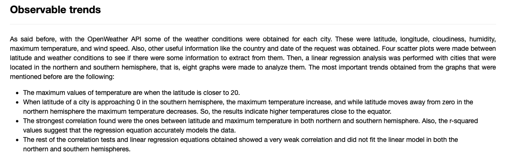
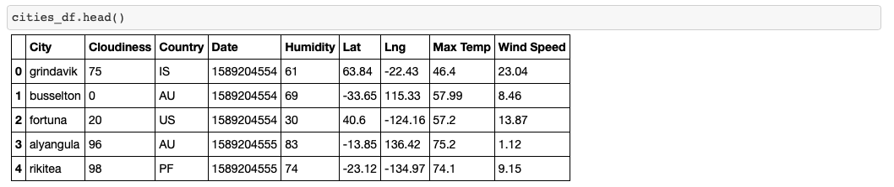
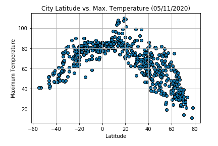
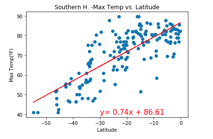
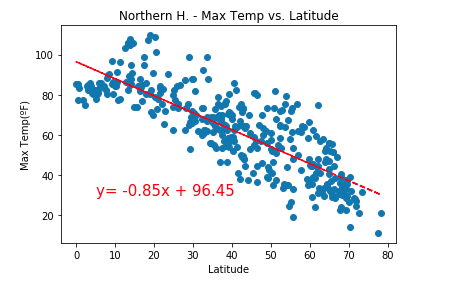
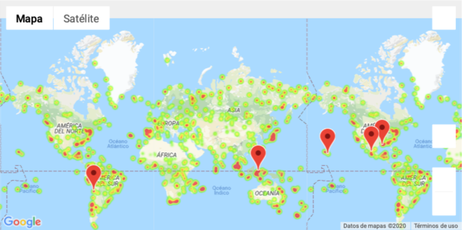

# Weather Analysis

The first part of the project is focused on visualizing the weather of 500+ cities across the world of varying distance from the equator to observe how the weather changes. A series of scatter plots and linear regressions models were made to examine the correlation between latitude vs. variables sucha as: temperature, humidity, cloudiness and wind speed.

The second part of the project allows us to establish specific weather conditions, find cities that satisfy this conditions and, identify the first hotel for each city located within 5000 meters of the coordinates.

## Features

* Exploratory analysis with pandas(Series of scatter plots and linear regression models)
* Pulled data from the OpenWeather API to assemble dataset
* Generate maps and locations with Google Places API

## Built with

* Python
* OpenWeather API
* Google Places API

## Outcomes

Observable trends

Generated dataset

Example of scatter plot generated 

Example of linear regression model

Example of linear regression model

Generated map with humidity heat layer and markers with hotel locations

